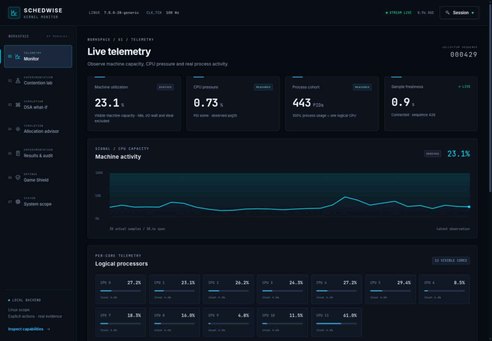
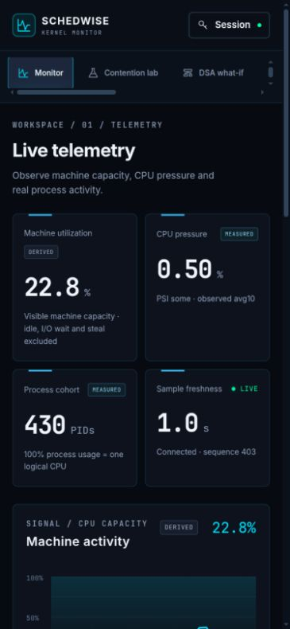

# Browser testing — 5 October 2026

Tested the existing in-app browser at the user-requested `http://localhost:5173/`, against the real unprivileged Linux backend. The previously blocked `127.0.0.1` browser origin was not used. This is a focused interactive pass, not exhaustive application certification.

## Fixes verified

- Session authentication errors now appear inside the reopened token dialog, and initial focus moves to the token input. Verified a 401 after backend token rotation and a successful connection afterward.
- Simulation results clear when capture, phase, or model inputs change. Reproduced old results persisting under a different capture; after the fix, changing from completed capture `871dc531…` to cancelled capture `d5c2784c…` removed the old algorithm deck/timeline and displayed the new capture metadata.

## Executed browser checks

- Unauthenticated telemetry remained unavailable; authenticated telemetry came from real Linux collection. Machine and core CPU were separately labeled.
- Process search with no match produced an explicit empty state. Inspection showed real boot/PID/start-ticks identity, nice, thread count and affinity; Escape closed the drawer.
- Keyboard ArrowRight moved from Monitor to Contention lab. Lab startup remained explicit; no full workload was launched.
- All five simulated models rendered from retained capture `871dc531-8762-4de8-aec0-75339d48140c`; switching the algorithm changed its modeled timeline. Outputs remained labeled SIMULATED.
- Results & audit loaded real retained captures and their comparison. Inspect opened the recorded-evidence dialog with original timestamp, quality, request and sample counts.
- Allocation advisor with no active trial displayed its evidence prerequisite. System scope disclosed visible Linux boundaries and unavailable optional sources.
- Backend disconnection produced stale age/error feedback; reconnection resumed real telemetry. Backend session rotation prompted token entry. Stream completion also reconnected.
- Shield defaults selected no background process and no affinity change. Tested exact confirmation using two temporary, same-user `/bin/sleep` children: target PID 37600 and selected background PID 37601. Browser confirmation displayed both identities and SIGSTOP. OS readback showed only PID 37601 in state T while target stayed S. Browser Disengage resumed it; readback showed both S. Both children were then terminated and waited for. No other application was intentionally changed.
- At requested 375 × 812 viewport, all seven panels had document width equal to viewport width (365 CSS px after scrollbar). Monitor and simulation visually inspected. Desktop monitor inspected at requested 1440 × 1000. Temporary viewport override reset afterward.
- Browser console inspection returned no warning/error entries at the end of the pass.

## Verification and evidence

After the fixes: `cd frontend && npm test && npm run typecheck && npm run build` passed: 12 frontend tests, strict typecheck and production build. Backend code was unchanged in this increment; the preceding combined hardening run passed 54 Java, 7 Python and 12 frontend tests.

Screenshots contain actual observed telemetry, not benchmark claims:

## Not exercised in this pass

No new complete contention/performance trial, nice restoration failure, PID-reuse race, crash recovery, capture-download interaction, or exhaustive keyboard/screen-reader pass was performed. Earlier backend checks and retained trial evidence remain separate. Shield crash and restoration limitations in `bug-audit.md` still apply.
