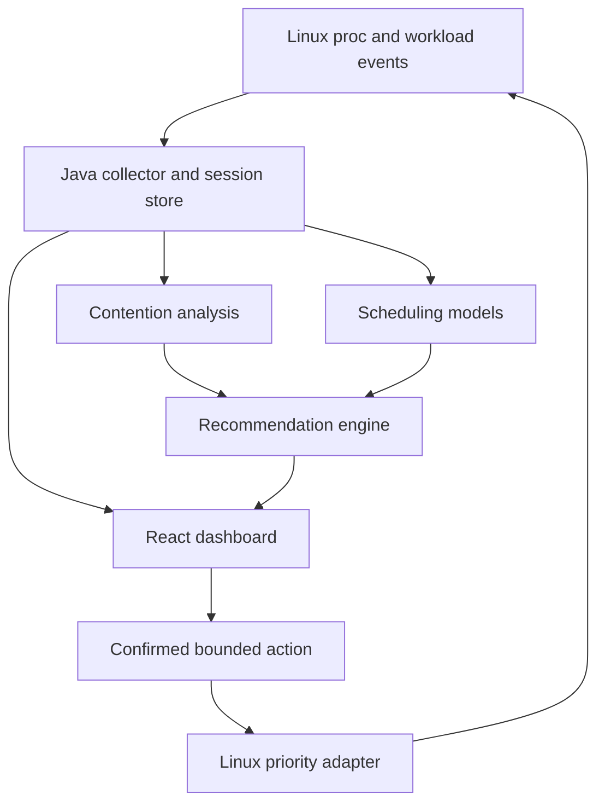

# SchedWise — Implementation Plan

Status: M1, M2, M3, M4, M5, and M6 fully implemented and verified on 4 October 2026. SchedWise v1 delivery is complete and locked. See `docs/build-status.md`, `docs/handoff.md`, `docs/m1-integration-evidence.json`, `docs/m2-integration-evidence.json`, `docs/m3-integration-evidence.json`, `docs/m4-integration-evidence.json`, `docs/m5-integration-evidence.json`, and `docs/m6-trials-evidence.json`.
Plan date: 4 October 2026.
Companion instructions: read `AGENTS.md` before implementing this plan.


## 1. Product and the problem it solves

**SchedWise is a Linux workload analyzer and CPU allocation advisor.** It helps a developer running a local API alongside compilation, hashing, or other batch jobs preserve service responsiveness when these workloads compete for CPU.

The primary user is a developer or small-server operator sharing limited CPU capacity between an important service and background work. The product answers:

1. Is CPU competition affecting my important workload?
2. Which competing tasks share its CPU resources?
3. What allocation change is worth trying, and what tradeoff does it create?
4. Did the change actually improve latency without stopping background work?

The visualizer supports these decisions. Project success means an end-to-end experiment using real processes and measured before/after results, not a populated dashboard alone.

**Faculty statement:** We monitor real Linux workloads, use DSA-based scheduling models to compare allocation scenarios, recommend explainable priority changes, and measure their actual effect on service latency and background throughput.

## 2. Locked scope and truth requirements

- **No mock data in the application or review demo.** Test-only fixtures cannot be presented as live system evidence.
- Linux-first backend; browser dashboard usable on Linux or Windows.
- On Windows, run the backend and workloads inside WSL2 or a Linux VM. WSL2 measurements describe that Linux environment, not native Windows applications.
- All live CPU, process, pressure, latency, throughput, and optimization-history values must come from actual measurements.
- No fake P1/P2 process lists, random metrics, static chart series, invented improvement percentages, or silent demo-data fallback in the application.
- The demo starts real bounded CPU workloads. Their calculated hashes, CPU time, progress, and requests are genuine work and measurements.
- Simulations necessarily produce modeled output. Label every such output **Simulated** and retain its measured input source and assumptions.
- Recorded sessions are allowed only when captured from a real run and explicitly labeled **Recorded**, with original time and environment. A recording cannot satisfy the live-demo requirement.
- Missing or inaccessible measurements are unavailable/null, never replaced with zero. Measured zero remains a valid distinct value.
- Do not claim the simulator replaces Linux scheduling, predicts exact kernel decisions, or guarantees a percentage improvement.

## 3. Platform and stack

| Component | Decision | Purpose |
| --- | --- | --- |
| Runtime | Native Linux preferred; WSL2/Linux VM supported after capability checks | Real Linux resources and scheduler controls |
| Backend | Java 21 + Spring Boot, Maven wrapper | Monitoring, analysis, simulation, APIs |
| Frontend | React + TypeScript + Vite | Browser dashboard |
| Live transport | REST commands + Server-Sent Events (SSE) | One-way measurement updates and explicit actions |
| Persistence | SQLite through JDBC, versioned SQL migrations | Real sessions, summaries, recommendations, audit history |
| Charts | A maintained React-compatible chart library, versions pinned | CPU, latency, throughput, and modeled timelines |
| Demo tools | Python 3 standard library + Linux `taskset`/`renice` | Small standalone service, workers, and measurement harness |
| Tests | JUnit; frontend test tooling; real Linux integration checks | Model invariants, parsing, boundaries, end-to-end behavior |

Use compatible maintained dependency releases and commit lockfiles. Verify actual APIs when implementing. Do not require Docker for the primary demo: containers can change the visible process namespace and CPU quota. No cloud account, LLM API, Kubernetes, or external database is required.

The CPU experiment runs locally. A remotely hosted dashboard cannot read the user's laptop CPU without a local backend; do not build a cloud-only dashboard and call it system monitoring.

## 4. Architecture and responsibilities



The collector remains independent of simulation and UI. Scheduler implementations are pure Java and cannot change operating-system settings. The controller uses a narrow Linux adapter. Each recommendation links to a captured session, model version, evidence, and action audit.

Proposed repository layout:

```text
schedwise/
  AGENTS.md
  plan.md
  README.md
  backend/
    pom.xml
    mvnw
    src/main/java/.../schedwise/
      api/
      monitor/
      model/
      analyzer/
      simulation/
      scheduler/
      optimizer/
      linux/
      persistence/
    src/main/resources/db/migration/
    src/test/
  frontend/
    package.json
    src/{api,components,pages,types}/
  tools/demo/
    service.py
    worker.py
    load_client.py
    run_experiment.py
  scripts/
    doctor.sh
    dev.sh
    verify.sh
  docs/
    architecture.md
    metrics.md
    demo.md
    limitations.md
  data/                  # ignored local real measurements and SQLite files
```

File names above are implementation targets, not existing commands or completed features.

## 5. Measurement design

### 5.1 Environment and capability discovery

Before showing live results, collect kernel release, environment type, available logical CPUs, allowed CPU mask, clock ticks per second, boot identity, process namespace information when accessible, and relevant cgroup CPU limits. Detect `taskset`, `renice`, Python, Java, and writable local storage.

Probe PSI, schedstat, affinity access, and priority permissions independently. Show a capability status and explanation for unavailable features. Monitoring should still work when an optional source is missing. Unsupported native Windows must display setup instructions rather than fake telemetry.

### 5.2 Real measurement sources

| Source | Collect | Important limit |
| --- | --- | --- |
| `/proc/stat` | Aggregate/per-logical-CPU counter deltas, runnable-thread count, context switches | Runnable count is system-wide; counter snapshots are not dispatch traces |
| `/proc/<pid>/stat` | CPU ticks, process state, nice, start ticks, last CPU | Names can contain spaces/parentheses; do not split the entire line on whitespace |
| `/proc/<pid>/status` | UID, allowed CPU list, thread count, memory; leader context switches if exposed | Leader-thread fields are not automatically totals for every thread |
| `/proc/<pid>/task/<tid>/...` | Selected workload thread CPU/scheduling measurements | Linux schedules threads; process aggregation loses detail |
| `/proc/pressure/cpu` | CPU `some` pressure trends and interval stall time | Optional; not process attribution; system-level CPU `full` is not meaningful |
| `/proc/<pid>/schedstat` / task schedstat | Runtime and runnable wait when available and active | Detect support; zeros can mean disabled accounting |
| `/proc/<pid>/cgroup`, affinity, optional autogroup | Shared resource scope and grouping context | Different groups can change the effect of nice |
| Demo service/client/worker events | CPU service demand, request timings, real work progress | Application instrumentation, not inferred from the process name |

Default collection interval: 1 second, configurable within bounded limits. Keep a 120-second in-memory ring buffer. Persist session summaries plus bounded raw data during an explicit experiment; use retention and sample limits. Do not continually enumerate every thread of every process for high-frequency detail: inspect selected workloads.

### 5.3 Units and formulas

Use monotonic clocks for durations and wall-clock timestamps for display. Read `CLK_TCK` from the environment through an adapter; do not assume 100.

- Process CPU seconds: `delta(utime + stime) / CLK_TCK`.
- Process CPU percentage: `100 * deltaCpuSeconds / deltaMonotonicSeconds`. Label this as **100% = one logical CPU**; a multithreaded process may exceed 100%.
- Machine CPU utilization: derive from aggregate CPU-counter deltas; report the idle/iowait convention. Do not double-count guest counters already included in user/nice. Show steal separately when available.
- Display selected-core utilization separately from whole-machine utilization. One saturated core can cause contention while aggregate CPU remains low.
- Process identity: `(bootId, pid, startTicks)`. Reused PIDs must never inherit samples or actions.
- Interval schedstat wait, when valid: delta of the runnable-wait counter with its documented units. Label the exact observed scope and interval.
- HTTP latency: client monotonic elapsed time from request dispatch to complete response; also log scheduled dispatch time, dispatch delay, errors, and timeouts.
- HTTP summaries: sample count, p50, p95, p99 when sample size supports it, completion rate, timeout/error rate, and offered request rate. Define the percentile method.
- Background throughput: actual completed hash operations or completed work units per wall-clock second. A timeout is not a fast request; report it separately and as a deadline miss.
- Improvement: `100 * (beforeP95 - afterP95) / beforeP95`, only for comparable valid nonzero baselines. Display negative values honestly.

Discard invalid deltas after counter reset, identity change, or nonpositive sampling interval. Mark process exits and partial reads explicitly. A newly observed process needs two valid samples before a CPU percentage appears.

## 6. Contention and workload roles

The user explicitly marks a selected workload as **Protected service**, **Background**, or **Observe only**. Managed demo processes have known roles from their launch configuration. Process names alone never prove importance or latency sensitivity.

Initial detector:

1. Locate the CPU affinity/cgroup scope shared by selected workloads.
2. Check sustained utilization of that scope across multiple samples.
3. Look for corroborating evidence: CPU PSI, selected tasks' runnable-wait deltas, or measured service latency degradation from a comparable baseline.
4. Report **High CPU usage** if utilization is the only evidence. Report **CPU contention likely** when competition/stall evidence is present. Explain the evidence and uncertainty.
5. Produce recommendations only for explicitly designated background work sharing the protected workload's constrained CPU scope.

Starting heuristic: core utilization above 85% for five valid samples, with additional evidence. Make thresholds configurable and identify them as heuristics. Global runnable count alone cannot establish contention on a particular core. High utilization can be productive and is not automatically a problem.

## 7. Scheduling engine and DSA

### 7.1 Input fidelity

Two measured input routes are supported:

**Instrumented demo route:** collect request arrival offsets, per-request CPU service time, actual background CPU/work measurements, roles, weights, and workload release information. Calibrate CPU demand without contention; freeze workload parameters before comparing scenarios. Trace arrivals are app arrivals, not exact kernel wake-up events.

**Arbitrary live workload route:** turn sampled CPU deltas into an explicitly labeled aggregate demand model over the capture window. Served CPU time is only a lower bound on requested CPU under contention. Do not present this as exact CPU bursts, remaining job duration, or known future arrivals. Offer qualitative advice when input is insufficient for quantitative prediction.

The first useful simulator models a **single logical CPU** matching the demo's affinity configuration. Multicore collection is supported; multicore simulation is future scope. State overhead, sleep/I/O, grouping, and dispatch-resolution assumptions in every result. Keep simulator time as integer nanoseconds or microseconds with one documented rounding policy.

### 7.2 Algorithms

| Model | DSA | Implementation and claim |
| --- | --- | --- |
| FCFS | `ArrayDeque` | Nonpreemptive reference model, ready-job FIFO |
| Round Robin | `ArrayDeque` | Preemptive configurable quantum; label as textbook RR, not Linux `SCHED_RR` |
| Priority | `PriorityQueue` | Nonpreemptive reference model; stable ties; expose starvation limitation |
| SJF | `PriorityQueue` | Nonpreemptive, known measured/calibrated demand; not an oracle for unknown jobs |
| Simplified classic CFS | `TreeSet` | Order by virtual runtime and unique job ID; weighted service; documented simplifications |
| EEVDF-inspired | Eligible set + virtual deadlines | Post-MVP extension after core real demo works; never claim kernel equivalence |

For classic CFS, remove a task before changing its ordering key, then reinsert. Update virtual runtime proportionally to execution divided by weight, using a documented Linux nice-to-weight mapping. `TreeSet` already supplies an ordered red-black-tree implementation; explain that rather than claiming to have built one from scratch.

Linux fair scheduling has evolved toward EEVDF since kernel 6.6. Record the running kernel and describe the CFS model as historical/simplified. Do not infer exact active kernel policy solely from a version number or use an old manual's CFS wording as proof of current implementation.

### 7.3 Results and complexity

Return a model timeline, queue state at modeled events, first-dispatch response time, ready-queue waiting time, and turnaround for jobs that finish within the modeled horizon. Unfinished jobs are censored; do not invent completion times. Simulated first-dispatch response is distinct from measured HTTP latency.

For continuously runnable tasks, show allocation shares. Optional Jain fairness uses `x_i = observedShare_i / targetShare_i`, then `(sum x_i)^2 / (n * sum x_i^2)` over an explicitly defined runnable cohort. Raw equal-share fairness is unsuitable when priorities intentionally differ. Suppress undefined fairness and handle idle intervals.

With `n` jobs and `e` modeled events: initial arrival sorting is `O(n log n)`; queue operations are `O(1)`; heap/tree updates are `O(log n)`; simulation cost depends on `e`, and timeline output uses `O(e)` space. Account for idle-event jumps and the number of RR slices. Do not describe every scheduler as simply `O(n)`.

Cap jobs, horizon, events, runtime, and timeline points. When an event limit is reached, return a clear partial result rather than a fabricated full schedule.

## 8. Recommendation and real priority control

Recommendations test a small bounded set of background nice values such as 5 and 10 while retaining the protected service's normal priority. These are candidate configuration values, not measured data. Score scenarios by modeled protected-job behavior and expected background allocation, with assumptions visible. Do not promise an exact HTTP p95 from aggregate CPU sampling.

Only allocation/weight scenarios with a documented relationship to nice may produce a nice recommendation. A better SJF or textbook RR result does not mean Linux can switch to that policy for the selected workload. Never apply FCFS, SJF, Priority, or RR simulator choices as kernel controls.

Every recommendation shows:

- Captured interval, process identities, workload roles, shared scope, and observed evidence.
- Proposed setting and why it is relevant.
- Simulated tradeoff, input quality, model version, and limitations; no invented confidence percentage.
- Whether the action is currently allowed and whether restoration is available.
- A separate measured validation result after the user tries it.

**MVP control boundary:** modify only SchedWise-managed, same-user, single-threaded demo workers recorded at launch. Other real processes can be monitored and analyzed but are read-only in v1. General own-process control is a later extension with explicit enrollment and thread semantics.

Apply requires a user click confirming the exact worker and nice change. The backend stays unprivileged. Use validated argument arrays through a Linux adapter, never concatenate input into a shell command. Recheck identity, UID, role, current setting, and allowed range immediately before acting, read back the result, and record per-action success/failure. Do not auto-apply because a detector fires.

Increasing nice lowers scheduling priority. Decreasing it again may require `CAP_SYS_NICE` or a suitable resource limit. Do not advertise universal Undo. For the managed demo, **Reset experiment** stops only owned demo workers and recreates them from the unchanged normal-priority launcher. It resets a workload; it does not undo the priority of the original process. Preserve measurements and label new identities. Do not give the entire Java backend elevated capabilities.

## 9. Dashboard and API contract

Dashboard sections:

1. **Environment:** Linux/WSL2/VM scope, collector status, capabilities, last sample age.
2. **Live resources:** aggregate/core CPU, optional CPU PSI, workload table, roles and affinities.
3. **Experiment:** start/stop owned workers, measured baseline/contention/after phases, progress and emergency stop.
4. **What-if:** capture source, models, assumptions, comparison, clearly simulated Gantt/queue views.
5. **Recommendations:** evidence, proposed setting, expected tradeoff, confirmation, application audit.
6. **Validation:** measured before/after latency and background throughput alongside separate model output.

Never render a sampled process-state chart as an exact live kernel run queue or dispatch Gantt. The live chart shows sampled CPU/state history. The Gantt shows simulation output; an exact measured dispatch timeline would require a later tracing feature.

Proposed endpoints, refined during implementation without changing the product scope:

| Method | Path | Behavior |
| --- | --- | --- |
| GET | `/api/capabilities` | Environment, sources, controls and limits |
| GET | `/api/snapshots/latest` | Latest real snapshot or explicit unavailable state |
| GET | `/api/events` | SSE with sequence, session ID, timestamps, reconnect handling |
| POST | `/api/captures` | Capture bounded real measurement window |
| POST | `/api/simulations` | Run model against capture ID and validated parameters |
| POST | `/api/recommendations` | Evidence-linked candidate allocation analysis |
| POST | `/api/actions/nice` | Confirmed managed-worker adjustment and audit |
| POST | `/api/experiments` | Start bounded real demo experiment |
| POST | `/api/experiments/{id}/stop` | Stop only tracked owned demo processes |
| GET | `/api/experiments/{id}` | Real measurements, phase state and comparisons |
| GET | `/api/sessions/{id}/export` | Export real results plus provenance and assumptions |

Each measurement payload includes source kind (`MEASURED`, `DERIVED`, `SIMULATED`, `RECORDED`), units, collection time, session ID, and validity/unavailability reason. Computed percentiles from observed requests are derived measurements; simulated values use a separate result structure.

Bind to loopback by default. Use a same-origin production bundle; allow only explicit dev origins. Mutating routes require a per-launch session token and trusted origin checks, including localhost protection against another website invoking actions. Protect SSE and exports as well. Do not accept arbitrary executable names, filesystem paths, shell text, or remote probe URLs from the browser.

## 10. Real-system demo protocol

### 10.1 Workloads

- A standalone single-threaded local HTTP service performs a fixed number of SHA-256 operations on a bounded in-memory buffer per request and returns a computed digest.
- Two separate single-threaded background processes perform finite hashing batches, exposing real work progress and CPU time.
- A load client sends requests at a fixed calibrated offered rate and logs request outcomes. Its request rate remains identical across comparison phases.
- All competing service/worker processes are pinned to one allowed logical CPU. Launch them as children without creating separate sessions, verify compatible cgroup/autogroup membership, and record these values. Do not globally disable autogrouping.
- Keep collector and load client off the constrained core when at least two allowed CPUs exist. On a one-CPU environment, label observer overhead and avoid overstating results.

An idle static web server is a weak demonstration because serving idle requests may require little CPU. The CPU-consuming endpoint creates an observable scheduling tradeoff. It is a controlled real workload, not a claim that every web service benefits equally from nice changes.

### 10.2 Measurement sequence

1. Run environment checks. Record kernel, CPU mask, quota, roles, IDs, grouping, clock settings, versions and workload parameters.
2. Calibrate and warm up the service without competitors; select a request rate below baseline capacity. Freeze hash iterations and request rate for the run.
3. Capture at least 30 seconds of service-only baseline after warm-up.
4. Start the real background workers at their verified original nice value. Capture at least 30 seconds of contention with unchanged service load.
5. Capture the modeled input, compare models, and show the recommendation and limitations.
6. After confirmation, lower the background workers' priority; verify actual settings. Keep all work running and capture another comparable window.
7. Show measured p95, errors/deadline misses, background hashes/sec, and sampled CPU/pressure. Separate any modeled estimates from actual observations.
8. Stop tracked demo workloads and export the real session. No broad name-based kill commands.

Use a fixed-rate/open-loop load schedule with bounded in-flight requests. Record scheduled times, missed dispatches, queueing/dispatch delay, timeouts and success counts to expose overload rather than allowing slower responses to silently reduce offered load. Set a hard timeout and log every scheduled request outcome.

For validation beyond the live review, run at least three matched contention/optimized trials, alternating order across fresh workers. Keep parameters and sampling windows fixed; retain all outcomes. Verify jobs remain active throughout each comparison window. If comparing completion time, use identical fixed work budgets in separate matched runs and wait for actual completion; do not extrapolate a completion time from 30 seconds of progress.

Default guardrails: two background workers on one selected CPU, bounded memory, maximum run duration of 180 seconds per live experiment, request/in-flight limits, and an emergency stop that cleans up tracked children. Longer repeated validation must be explicitly configured and remain bounded. Clean up on cancellation, timeout, startup failure and normal exit. Do not launch full-machine saturation automatically.

If an experiment shows no improvement, show it. Check scope, grouping, demand, virtualization interference and observer overhead. Diagnose or rerun with recorded parameter changes; never replace the results with expected numbers.

## 11. Implementation milestones and acceptance gates

### M1 — Real collection first

Implementation status (4 October 2026): collector, capabilities, authenticated REST/SSE, SQLite foundations and Live Monitor implemented. Automated tests/builds and controlled-child Linux integration passed. Browser opening was denied, so the complete dashboard acceptance gate remains pending; M1 is not declared fully accepted. Details and commands: `docs/build-status.md`.

Build the backend skeleton, capability doctor, real `/proc` adapter, identities, CPU formulas and minimal live API. Connect a small UI to actual data immediately.

Gate: real CPU/PID readings update; compare interval measurements with `pidstat`/`top` when available using equivalent units and windows. Unavailable sources and process exits are handled. No sample-data mode exists.

### M2 — Measurable real demo

Implement service, workers, load client, lifecycle registry, CPU pinning and session export. Add measured baseline and contention phases before a recommendation engine.

Gate: genuine service digests, worker progress, timings and raw measurements exist; the chosen constrained workload shows measurable competition or the failure is diagnosed. Stop removes all owned demo children. Dashboard values match exported observations.

### M3 — DSA models against captured work

Implement FCFS, RR, Priority, SJF and simplified CFS; event engine, measured input adapter, metrics and modeled timeline. Add bounds and deterministic tie handling.

Gate: scheduler invariants and edge cases pass. Every result references a real capture. Model timelines are labeled simulated; arbitrary snapshots are never promoted into exact kernel traces.

### M4 — Explainable recommendation and bounded apply

Implement role tagging, contention evidence, weighted allocation candidates, explainability, confirmation, validated Linux adapter and per-action audit.

Gate: only managed eligible background workers can change; stale identities and foreign processes are rejected. Actual nice values are read back. Restoration limitations and reset behavior are correct. No privilege is granted to the backend.

### M5 — Integrated dashboard and validation

Implementation status (4 October 2026): 6-tab browser interface (Environment, Live Monitor, Experiment, What-If, Recommendations, Results), 3-way measurement (Baseline vs Contention vs After Action), scientific comparability engine, and ZIP export packaging implemented and verified. Full live trial (ID 416dd0e3-9520-4293-9e17-66c81545be27) demonstrated complete real-system loop with 91.37% p95 latency recovery and clean child termination. Automated verification passed with exit code 0 (32 JUnit tests, 4 Node stream tests, tsc, vite build). Details and evidence: `docs/build-status.md` and `docs/m5-integration-evidence.json`.

Finish core/aggregate graphs, sample freshness, captures, models, recommendation flow, actual comparison and export. Implement measured errors/timeouts and trial comparison.

Gate: a complete live run demonstrates collection → analysis → modeling → confirmed control → measurement. Run matched trials, retain negative outcomes, and compare meaningful latency/throughput tradeoffs.

### M6 — Reproducible delivery

Implementation status (4 October 2026): Read-only system diagnostic (`scripts/doctor.sh`), unified verification suite (`scripts/verify.sh`), bounded multi-trial runner (`scripts/run_trials.py`), passive development start (`scripts/dev.sh`), comprehensive architecture guide (`docs/architecture.md`), runbook (`docs/demo.md`), metrics definitions (`docs/metrics.md`), and system limitations (`docs/limitations.md`) implemented and verified. Real 3-pair matched trials (6 trials, Core 11, alternating order, 14,310 requests) demonstrated 89.91% p95 latency improvement and 95.16% recovery with 100% clean process termination. All verification checks exit 0 cleanly. Details and evidence: `docs/build-status.md`, `docs/handoff.md`, and `docs/m6-trials-evidence.json`.

Provide one documented development startup, Linux/WSL2 setup, doctor, verification command, demo runbook, metrics definitions and limitations. Document actual commands only after implementing and executing them.

Gate: backend tests/build and frontend typecheck/build pass; real Linux integration and cleanup checks pass on at least one identified environment. Native Linux is preferred for final review; WSL2 is acceptable when scope and observed limitations are disclosed.

Complete milestones in order. EEVDF-inspired simulation, delegated cgroup controls, arbitrary enrolled-process control, tracepoint/eBPF capture, multicore models and Windows-native monitoring are future scope, not blockers for v1.

## 12. Team allocation

| Owner | Work | Integration responsibility |
| --- | --- | --- |
| Member 1 | Java scheduler models, event engine, DSA reasoning, model tests | Accept measured captures; publish result schema |
| Member 2 | Linux collection/control, real demo, contention/recommendations | Own identities, capabilities, action checks and measurement protocol |
| Member 3 | React dashboard, charts, SSE, evidence/validation views | Render real schemas and explicit empty/error/stale states |

Agree on units, role labels, source kinds and API types before parallel implementation. Integrate each milestone; do not let the frontend depend on fabricated placeholder metrics.

## 13. Verification and definition of done

- Parser checks include process names with spaces/parentheses, permission errors, counter reset, exits and PID reuse.
- Scheduler tests include simultaneous arrivals, stable ties, idle periods, late arrivals, RR quantum boundaries, weighted service, unfinished jobs and event limits.
- Linux checks start real controlled children, sample their CPU, apply an allowed nice increase, verify readback, reject an invalid target and confirm cleanup.
- UI checks cover unavailable/zero/stale data, lost SSE connection, simulation labels, action failure and recorded-vs-live mode.
- The experiment exports raw requests, measured samples, phase boundaries, worker progress, recommendations, audit, parameters and versions.
- No percentage gain is displayed without enough real data or a clearly marked model calculation.
- No claim is made that lowering nice reduces total CPU utilization, speeds every workload, or makes Linux run the simulated algorithm.
- All required gates are actually checked. Record command outcomes and environment; clearly mark unexecuted checks.

The final demo succeeds as an honest experiment even if a particular machine produces a modest tradeoff. A claimed performance benefit requires repeatable measured improvement; that claim cannot be substituted with simulator output.

## 14. Technical references

Consult these primary references during implementation; checked for this plan on 4 October 2026. These describe platform behavior, not guarantees about SchedWise performance.

- [Linux EEVDF design](https://www.kernel.org/doc/html/latest/scheduler/sched-eevdf.html)
- [Classic CFS design](https://www.kernel.org/doc/html/latest/scheduler/sched-design-CFS.html)
- [Linux proc filesystem](https://www.kernel.org/doc/html/latest/filesystems/proc.html)
- [Process stat fields](https://man7.org/linux/man-pages/man5/proc_pid_stat.5.html)
- [Linux CPU pressure information](https://docs.kernel.org/accounting/psi.html)
- [Priority changes, permission limits, and thread behavior](https://man7.org/linux/man-pages/man2/setpriority.2.html)
- [Scheduler API and autogroup/group-scheduling semantics](https://man7.org/linux/man-pages/man7/sched.7.html)
- [WSL1 versus WSL2](https://learn.microsoft.com/en-us/windows/wsl/compare-versions)

For schedstat formats and nice-to-weight constants, verify against documentation/source matching the tested kernel before implementing. Where older manual wording conflicts with current kernel scheduler design, use current kernel documentation and report the tested environment.

## UI redesign follow-up — 4 October 2026

The separately supplied Cyberpunk OS frontend plan is implemented across all seven modules. Existing milestone requirements and API contracts remain in place. Repository verification passed (42 Java, 7 Python, 10 frontend tests, typecheck/build). Browser visual and interactive acceptance is still unverified due to a saved browser-access restriction; this increment is not evidence of a completed manual application-testing pass. See `docs/ui-redesign.md` for changes, corrections, and remaining checks.

## Hardening audit — 5 October 2026

The user approved extending Game Shield to explicitly selected external applications with full process identities and exact confirmation. This exception is limited to Shield; the Allocation Advisor retains managed-worker controls. Implicit all-process actions have been removed. Shield is bounded to 180 seconds while the backend is running, and restoration failures remain visible. Abrupt backend death and residual PID races remain limitations, so the extension is not certified crash-safe. See `docs/bug-audit.md` for fixes, evidence, and remaining browser acceptance checks. Earlier completion/performance statements describe their historical milestone runs, not verification of this extension.

## Browser testing follow-up — 5 October 2026

Focused interactive testing completed at the user-requested localhost origin, including real telemetry, recorded simulation, authentication/reconnection, responsive widths, and controlled Shield suspend/resume with OS readback and cleanup. Two frontend defects were fixed and frontend tests/typecheck/build passed. See `docs/browser-testing.md` for the executed checks and remaining acceptance work. This pass does not replace the real experiment protocol or certify exhaustive browser acceptance.
